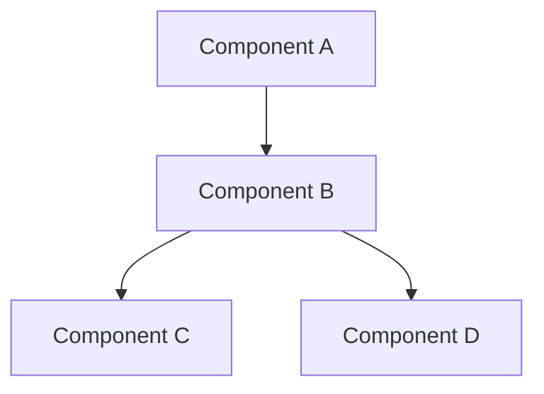

# {Feature Name} Architecture

## System Design

### Overview

- High-level architecture diagram
- Key components
- Data flow patterns
- Integration points

### Component Relationships

### Data Flow

- Input handling
- Processing steps
- Output generation
- Error handling paths

## Technical Decisions

### Technology Choices

- Framework/Library choices
  - Rationale
  - Alternatives considered
- State management
  - Approach
  - Justification
- Data storage
  - Solution
  - Reasoning

### Design Patterns

- Pattern 1
  - Use case
  - Implementation details
- Pattern 2
  - Use case
  - Implementation details

### Performance Considerations

- Caching strategy
- Optimization techniques
- Load handling
- Resource management

## Dependencies

### External Services

- Service: {name}
  - Purpose
  - API version
  - Rate limits
  - Fallback strategy

### Internal Dependencies

- Module: {name}
  - Purpose
  - Version
  - Integration points
  - Error handling

### Configuration

- Environment variables
- Feature flags
- Runtime configuration
- Build-time settings

## Security

### Authentication

- Method
- Implementation
- Token handling

### Authorization

- Access control
- Role management
- Permission checks

### Data Protection

- Encryption methods
- Data handling
- Privacy considerations

## Monitoring

### Metrics

- Key performance indicators
- Health checks
- Alert thresholds

### Logging

- Log levels
- Important events
- Error tracking

## Deployment

### Requirements

- Infrastructure needs
- Dependencies
- Configuration

### Process

- Deployment steps
- Rollback procedure
- Health checks

## Future Considerations

- Scalability plans
- Upcoming changes
- Technical debt
- Improvement opportunities
