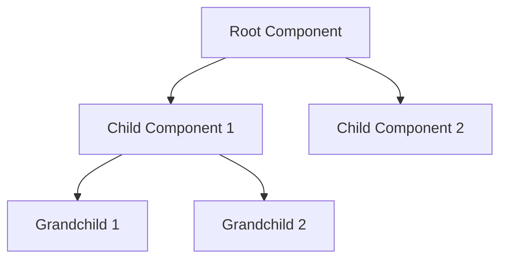

# {Feature Name} Components

## Component Tree

### Hierarchy



### State Management

- Global state
- Local state
- State flow between components

## Individual Components

### {ComponentName}

#### Purpose

- Primary responsibility
- Use cases
- When to use

#### Props Interface

```typescript
interface {ComponentName}Props {
  /** Description of prop1 */
  prop1: string;
  /** Description of prop2 */
  prop2?: number;
  /** Description of prop3 */
  prop3: (value: string) => void;
}
```

#### Usage Example

```tsx
import { {ComponentName} } from '@/components/{feature-name}';

const ExampleUsage = () => {
  return (
    <{ComponentName}
      prop1="example"
      prop2={42}
      prop3={(value) => console.log(value)}
    />
  );
};
```

#### State Management

- Internal state structure
- State update patterns
- Side effects

#### Event Handlers

- Event types
- Handler implementation
- Error handling

#### Styling

- CSS/Tailwind classes
- Theme integration
- Responsive design

#### Testing

- Key test scenarios
- Edge cases
- Performance considerations

#### Accessibility

- ARIA roles
- Keyboard navigation
- Screen reader support

## Shared Components

### Common Patterns

- Reusable patterns
- Best practices
- Anti-patterns to avoid

### Component Communication

- Event handling
- Prop drilling
- Context usage

## Performance Optimization

### Rendering

- Memoization strategy
- Re-render prevention
- Code splitting

### Data Loading

- Loading states
- Error states
- Caching strategy

## Testing Strategy

### Unit Tests

- Component isolation
- Props validation
- Event handling

### Integration Tests

- Component interaction
- State management
- Side effects

### E2E Tests

- User flows
- Error scenarios
- Performance benchmarks
